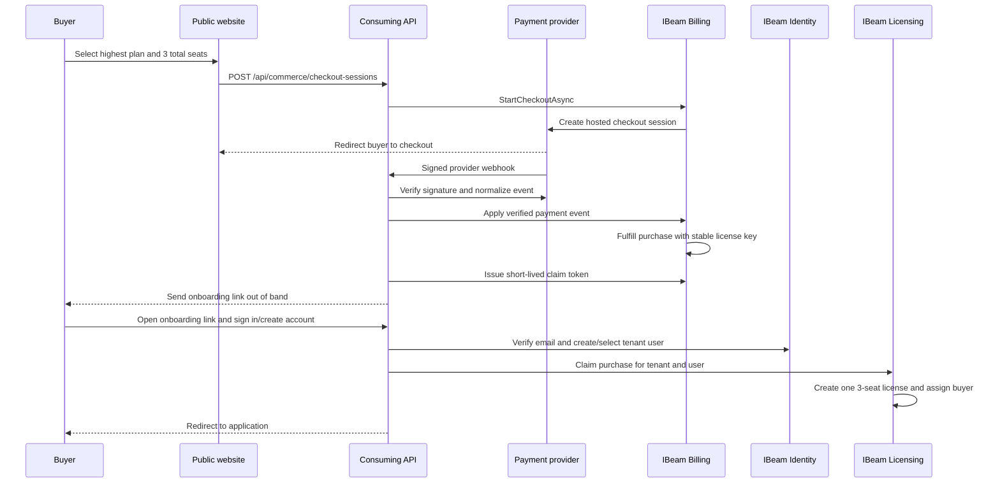
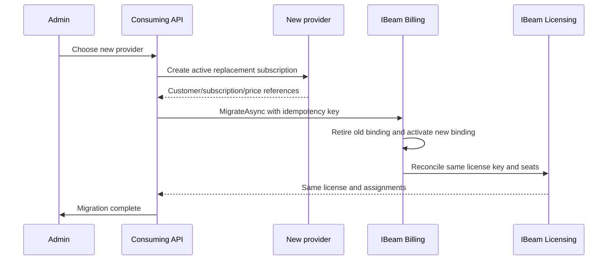

# IBeam Commerce Integration Guide

This guide maps a public purchase into one durable IBeam license. The example buys the highest plan with three total seats before the buyer has an Identity account. Stripe is used as an example adapter; PayPal or another processor follows the same IBeam contracts.

## Ownership Boundaries

| Component | Owns | Does not own |
| --- | --- | --- |
| Public website | Plan selection, buyer email, seat quantity, success/cancel navigation | Payment verification, licenses, Identity users |
| Consuming API | Provider adapter, Identity onboarding, orchestration endpoints, notifications | Provider-neutral Billing/Licensing rules |
| IBeam Billing | Offers, quotes, purchase state, provider events, subscriptions, idempotency | Runtime authorization |
| IBeam Licensing | One durable license key, plan, status, limits, seat assignments | Charging the customer |
| IBeam Identity | Verified users, tenants, roles, OAuth/API credentials | Commercial entitlement state |
| Runtime enforcement | Tenant, subject, operation, entitlement, seat/credit checks | Checkout UI decisions |

Billing records what happened commercially. Licensing decides whether the tenant has a usable grant. Identity proves who is acting. Runtime code must authorize against Licensing and AccessControl; a successful payment response by itself never grants API or MCP access.

## End-to-End Purchase



The checkout request contains no tenant or user id. Billing stores the normalized buyer email only for matching the later claim. The consuming API creates or resolves Identity records after the provider has verified payment.

## Host Registration

Register the in-memory defaults first, then replace them with the durable Azure Table store. Register each provider adapter as `IBillingCheckoutGateway`.

```csharp
using IBeam.Billing.Api;
using IBeam.Billing.Licensing;
using IBeam.Commerce.Repositories.AzureTable;
using IBeam.Licensing.Services;

builder.Services.AddIBeamBillingApi(builder.Configuration);
builder.Services.AddIBeamLicensingServices(builder.Configuration);
builder.Services.AddIBeamBillingLicenseReconciliation(options =>
{
    options.MinimumMultiUserSeats = 3;
    options.PaymentFailureBehavior = BillingLicensePaymentFailureBehaviors.Grace;
    options.DefaultGracePeriodDays = 7;
});
builder.Services.AddIBeamCommerceAzureTableStores(builder.Configuration);
builder.Services.AddScoped<IBillingCheckoutGateway, StripeBillingCheckoutGateway>();
```

Keep provider API keys, webhook secrets, the checkout status signing key, and storage credentials in a secret store. Do not put them in offer metadata, provider-event metadata, logs, URLs, or source control.

## Public Endpoints

These controllers are supplied by `IBeam.Billing.Api`.

### Start checkout

```http
POST /api/commerce/checkout-sessions
Content-Type: application/json
```

```json
{
  "idempotencyKey": "purchase-8df76a",
  "offerKey": "hubbsly-enterprise-monthly",
  "totalSeats": 3,
  "buyerEmail": "buyer@example.com",
  "providerName": "stripe",
  "successUrl": "https://app.example.com/purchase/success",
  "cancelUrl": "https://www.example.com/plans"
}
```

The response uses the standard `{ "success": true, "data": ..., "traceId": "..." }` envelope. `data` is:

```json
{
  "purchaseId": "GUID",
  "status": "awaiting-payment",
  "offerKey": "hubbsly-enterprise-monthly",
  "licenseQuantity": 1,
  "totalSeats": 3,
  "currency": "USD",
  "totalAmount": 150.00,
  "checkoutUrl": "https://provider.example/checkout/session",
  "statusToken": "short-lived-signed-token",
  "statusTokenExpiresUtc": "2026-08-10T12:30:00Z"
}
```

Redirect the browser to `checkoutUrl`. Treat `licenseQuantity` as one; `totalSeats` is the capacity on that license. Sending the same idempotency key with the same request returns the existing purchase/session. Reusing it with different seats, offer, or buyer is rejected.

### Read public status

```http
GET /api/commerce/purchases/{purchaseId}/status?token={statusToken}
```

The response contains only `purchaseId`, status, offer, total seats, currency, amount, next action, and expiry. It omits buyer email and all provider references. Poll this endpoint after the browser returns; never accept the browser redirect itself as proof of payment.

### Receive provider webhooks

```http
POST /api/billing/webhooks/{providerName}
```

The provider adapter must verify the raw body and signature before returning `BillingVerifiedWebhookInfo`. The normalized metadata must include `purchaseId`. IBeam deduplicates by provider plus provider event id and only invokes fulfillment after a verified paid event.

## Identity Onboarding And Claim

The consuming API owns the onboarding route because it combines application-specific Identity UX with `IBillingPurchaseClaimService`. A typical host endpoint is:

```http
POST /api/commerce/purchases/{purchaseId}/claim
Authorization: Bearer {human-user-token}
Content-Type: application/json
```

```json
{
  "claimToken": "one-time-token-from-onboarding-link"
}
```

The host resolves `tenantId`, `userId`, and verified email from the authenticated Identity session, not from caller-supplied ids:

```csharp
var result = await claims.ClaimAsync(new ClaimBillingPurchaseLicenseRequest
{
    ClaimToken = request.ClaimToken,
    TenantId = identity.TenantId,
    UserId = identity.UserId,
    VerifiedEmail = identity.VerifiedEmail
}, ct);
```

After the verified paid event fulfills the purchase, a host workflow calls `IssueAsync(purchaseId)` and sends the resulting short-lived token to the normalized buyer email. Do not put that raw token in provider metadata, a public status response, or logs. The host can run this workflow from its verified-webhook orchestration or an idempotent background notification job.

On success, IBeam creates or reuses one license with the purchase's stable GUID key, grants three total seats, assigns the buyer to the first seat, binds the purchase to the tenant/user, and moves it to `claimed`. Replaying the same token for the same tenant/user returns the same license and assignment. A different tenant, user, or verified email is rejected.

## Admin And Recovery Endpoints

These built-in routes require a matching tenant claim and `Owner`, `Administrator`, `Admin`, or `billing.commerce.admin` access.

| Method and route | Purpose | Request DTO |
| --- | --- | --- |
| `GET /api/billing/commerce/tenants/{tenantId}/purchases/{purchaseId}` | Inspect redacted purchase, subscription, license, seats, claim, bindings | None |
| `POST .../provider-events/{provider}/{eventId}/retry` | Retry a stored failed verified event | `{ "reason": "..." }` |
| `POST .../purchases/{purchaseId}/retry-fulfillment` | Idempotently rerun paid fulfillment | `{ "reason": "..." }` |
| `POST .../purchases/{purchaseId}/resend-claim` | Rotate the onboarding claim token | `{ "reason": "..." }` |
| `POST .../purchases/{purchaseId}/corrections` | Apply a controlled purchase-state correction | `{ "reason": "...", "idempotencyKey": "...", "status": "paid" }` |

Inspection redacts buyer email and never returns claim hashes, provider payload references, status tokens, access tokens, or provider secrets. A resend response contains the new one-time claim token so the host can deliver it; the previous unclaimed token becomes invalid.

## Seat Changes And Provider Migration

An individual license always starts as one license with one seat. When it expands to multi-user, the default minimum is three total seats, not three additional seats. Existing license GUIDs and assignments remain stable.



The host owns a migration endpoint because it must create and verify the target provider subscription first. Call `IBillingProviderMigrationService.MigrateAsync` with `MigrateBillingProviderRequest`. Only one provider binding remains active, history is retained, and retries with the same idempotency key return the same migration. Do not cancel the source subscription until the target subscription is active and IBeam migration succeeds.

## Failure Policy

| Event | Billing result | Licensing result |
| --- | --- | --- |
| Payment failed before fulfillment | Purchase becomes `failed`; no license is created | None |
| Checkout/subscription canceled before fulfillment | Purchase becomes `canceled`; no license is created | None |
| Renewal payment fails | Subscription becomes past due | Configured grace, suspension, expiry, or no-op policy |
| Subscription canceled after activation | Subscription becomes canceled | Configured suspension, expiry, revocation, or scheduled revocation |
| Refund/dispute | Purchase becomes refunded | Configured suspension, expiry, revocation, or scheduled revocation |
| Seat decrease below assignments | Commercial request is recorded | Preserve assignments, allow over-assigned, or reject per policy |

## Security Checklist

- Allow-list exact HTTPS success and cancel origins. Never use an arbitrary return URL from the browser.
- Verify webhook signatures over the raw body before writing Billing, Licensing, Identity, or notification state.
- Use separate idempotency keys for checkout, provider events, migrations, and manual corrections.
- Store claim tokens only as hashes; deliver the raw value once, expire it quickly, and rotate it on resend.
- Resolve tenant, user, and verified email from the authenticated Identity session during claim.
- Keep buyer PII out of public status, provider metadata, logs, traces, and support responses.
- Keep API keys, OAuth client secrets, provider secrets, signing keys, and raw provider payloads out of API responses and audit details.
- Audit recovery, claim rotation, provider migration, seat changes, and manual correction with actor, tenant, reason, and correlation id.
- Enforce licenses, seats, permissions, and credits in server-side runtime operations. UI state is guidance only.

## Validation Matrix

The Billing suite covers the complete purchase/claim flow plus the supporting policies:

| Scenario | Test |
| --- | --- |
| Anonymous highest-plan purchase, verified payment, replay, one license, three seats, buyer assignment | `CommerceEndToEndTests.HighestPlan_AnonymousCheckoutCreatesAndClaimsOneThreeSeatLicense` |
| Failed payment and cancellation create no claimable license | `CommerceEndToEndTests.UnsuccessfulCheckout_DoesNotCreateAClaimableLicense` |
| One-seat individual license expands to three total seats | `BillingLicenseReconciliationTests.ReconcileAsync_ExpandsIndividualLicenseToMinimumMultiUserSeats` |
| Provider migration preserves license and assignments | `BillingProviderMigrationTests.MigrateAsync_PreservesInternalSubscriptionLicenseAndSeats` |
| Provider event replay is idempotent | `BillingWebhookProcessorTests.VerifiedPayment_UpdatesPurchaseAndReplayDoesNotDuplicateEvent` |
| Claim replay returns the same license and seat | `BillingPurchaseClaimTests.ExistingBuyer_RetryReturnsSameLicenseAndSeat` |

Run:

```powershell
dotnet test IBeam.Tests.Billing/IBeam.Tests.Billing.csproj
dotnet test IBeam.Tests.Licensing/IBeam.Tests.Licensing.csproj
```
